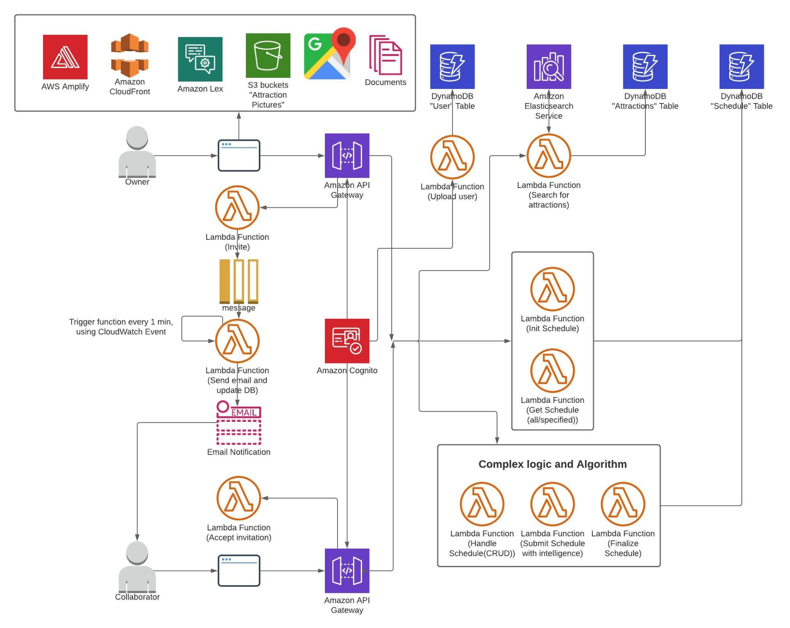
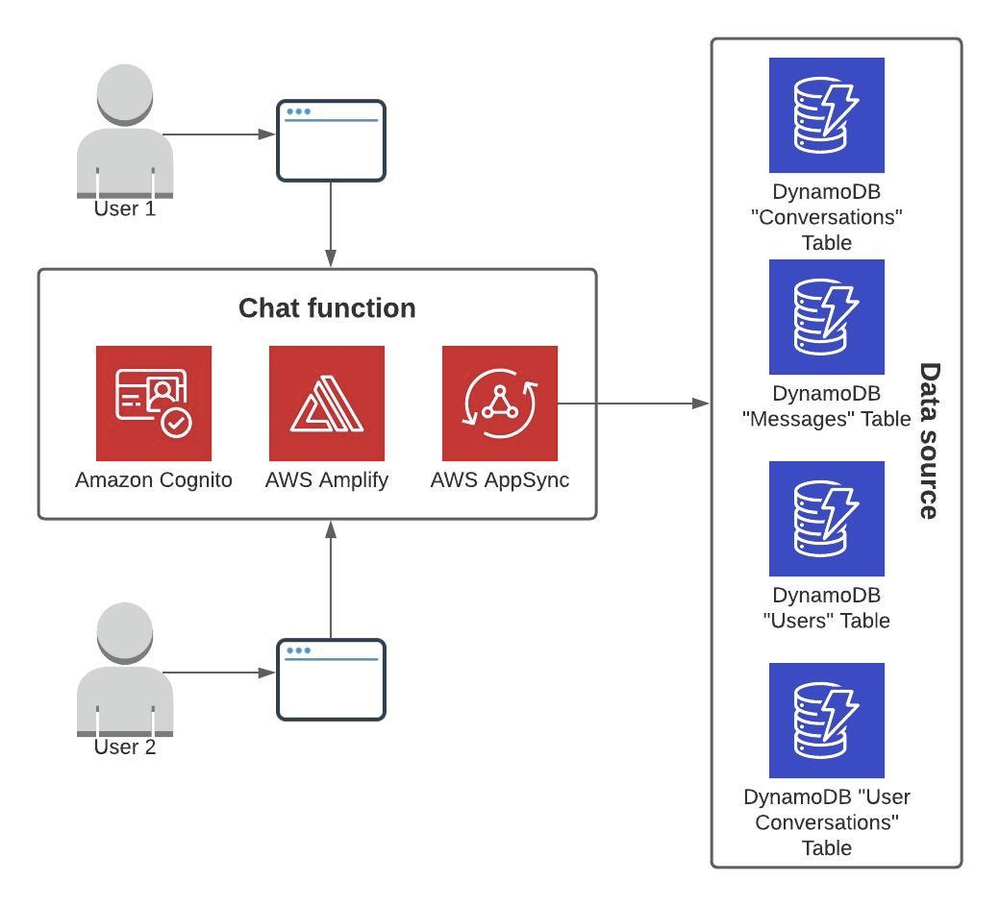

# Cloud-Travel-Planner-Platform
Platform to make travel plans on cloud.
COMS E6998 Cloud Computing & Big Data team project @ Columbia.

## Introduction

Planning can be extremely complex when multiple people are involved 
in one trip. We try to build a web application dealing with travel 
planning, including attraction recommendations, schedule arrangement, 
and collecting partners’ opinions. By using this application, you can 
have a list of attractions without worrying about not having a choice. 
And you will get a detailed schedule arrangement with clear instructions. 
Last but not least, you can share your schedule with your partners 
allowing them to edit the schedule with you or just let them mark 
their choices to help you make the decision. You can even chat with 
them in a small chat room. It is a scale application based on AWS.

## Overview

Overall Architecture

Chat Room Design

As a web application for travel planning, our functions fall into 3 main categories, namely user-related, schedule-related, and attraction-related. Our overall architecture is shown in figure 1. It primarily uses Amazon Web Service, which provides our application reliability and scalability. We use AWS Cognito to manage our user identities. A user can create a travel schedule through Lambda Function by adding various places of interest by searching in elastic search. Users can also invite his/her friends by email through AWS SQS and SES service. Other details will be introduced later.

The whole application is deployed via AWS Amplify, which is a set of tools to build scalable full-stack applications. The Amplify service will call CloudFormation to construct backend services and use CloudFront to deploy the front end web application. Amazon CloudFront is integrated into the application to ensure low latency data transfer. 

The frontend directly interfaces with Amazon Lex, AppSync, S3 bucket, Google API. It interacts with API Gateway to call backend functions and get corresponding responses to show in the front. After users determine their schedule, the output pdf file representing the schedule can be downloaded through the frontend, which is denoted in figure 1 as documents, by calling the backend Lambda.

All backend logic is implemented in the AWS Lambda and other AWS cloud services. Lambda functions work with AWS services including API Gateway, Cognito, Elastic Search, DynamoDB, S3, SQS, and SNS. As mentioned above, API Gateway is how the frontend calls the backend. Amazon Cognito provides user authentication and identification for the whole application. In our backend service, ElasticSearch is responsible for searching for attractions. All data except images are stored in DynamoDB. S3 bucket is introduced to store image data. SNS is applied here to notify the user about the invitation. Before calling SNS to send an email, all requests will be pushed into an SQS. And then to allow the asynchronous processing, the trigger activated by CloudWatch Event is added to the function calling SNS.

## TODO
- [ ] Beatify frontend code.
- [ ] Beatify frontend design. 
- [ ] CI/CD with higher coverage.

## Documentation

- Final Report: [report pdf](docs/Report.pdf)
- Presentation Slides: [presentation slides pdf](docs/Presentation.pdf)
- Demo Video: [Demo Video](https://youtu.be/vPvBxfRCgwo)

## [Contribution](CONTRIBUTING.md)

All Four of our team try our best to contribute to this project.

## Acknowledgements

Thanks to Professor Sambit Sahu the instructor of our course, who brought us to the Cloud Computing world and let us know how to utilize 
 project based on different cloud services and realize the importance cloud services in software development nowadays.

Thanks to Goutham Reddy Kotapalle, Hyun Soo Jeon, Rishabh Narang and Hyun Soo Jeon, TAs of our course, who provided very solid and helpful knowledge about
 different AWS cloud services.

## Contact

- Xinyue Wang `xw2647`: [email](mailto:xw2647@columbia.edu.com)
- Yuanmeng Xia `yx2548`: [email](mailto:yx2548@columbia.edu.com)
- Wenjie Chen `wc2685`: [email](mailto:wc2685@columbia.edu.com)
- Chong Hu `ch3467`: [email](mailto:ch3467@columbia.edu.com)

## License

Copyright (c) 2020, `Cloud-Travel-Planner`. All rights reserved.

The code is distributed under a MIT license. See [`LICENSE`](LICENSE) for information.
